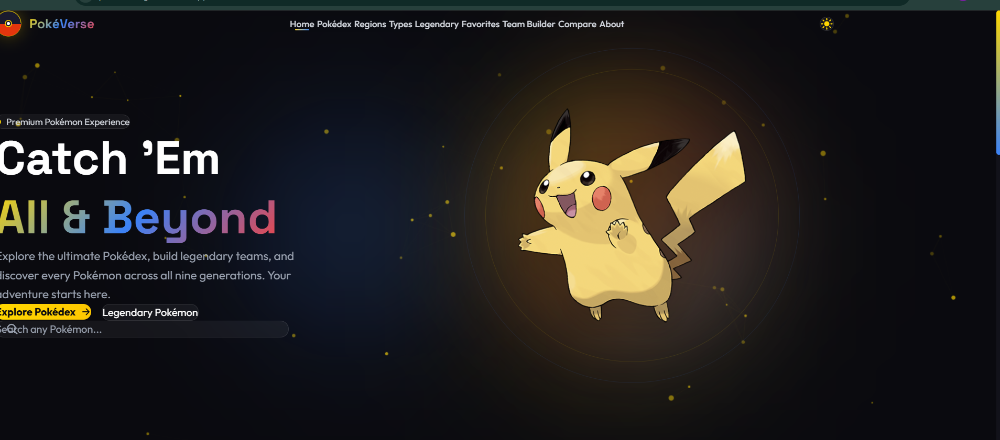

# 🟡 PokéVerse

A modern and responsive Pokémon web application built using **React**, **Vite**, **Tailwind CSS**, and **PokéAPI**.

## 🌐 Live Demo

https://pokeverse-gules.vercel.app/

## 📸 Preview



---

## ✨ Features

* 🔍 Search Pokémon by name
* 📖 Detailed Pokémon information
* ❤️ Favorites System
* ⚔️ Compare Pokémon
* 👑 Legendary Pokémon
* 🌍 Pokémon Regions
* 🎨 Dark / Light Theme
* 📱 Fully Responsive Design
* ⚡ Fast performance with Vite
* 💫 Smooth animations

---

## 🛠️ Tech Stack

* React
* Vite
* Tailwind CSS
* JavaScript
* PokéAPI
* Framer Motion
* GSAP

---

## 🚀 Installation

```bash
git clone https://github.com/nitish19work-ctrl/pokeverse.git

cd pokeverse

npm install

npm run dev
```

---

## 📂 Folder Structure

```
src
 ├── api
 ├── assets
 ├── components
 ├── context
 ├── data
 ├── hooks
 ├── pages
 └── utils
```

---

## 📌 Future Improvements

* Pokémon Battle Simulator
* Multiplayer Team Sharing
* Trainer Profiles
* Offline Support (PWA)
* AI Pokémon Recommendations

---

## 👨‍💻 Author

**Nitish Pal**

GitHub: https://github.com/nitish19work-ctrl
